---
# Feel free to add content and custom Front Matter to this file.
# To modify the layout, see https://jekyllrb.com/docs/themes/#overriding-theme-defaults

layout: default
title: Team SegFault
---

# Mid-Term Project Update

## Abstract

The goal of our project is to compare different segmentation methods that we have learned about in class with current state-of-the-art techniques. We will also explore how different feature spaces affect clustering and graph-based approaches to segmentation.

For this milestone, we have compared the KMeans and Mean Shift algorithms in terms of how well they perform in segmentation on the BSDS500 dataset of images. We also compared the feature spaces of color (RGB or HSV) and color + position (pixel coordinates).

## Teaser Figure

  
  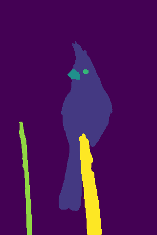 
  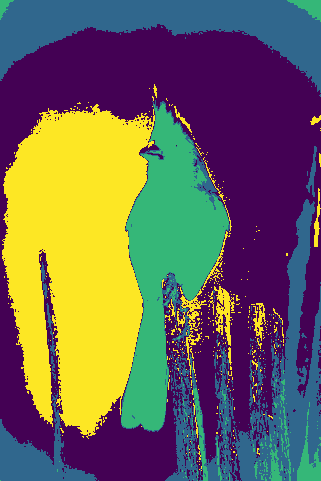 
  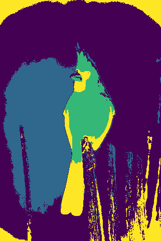 
  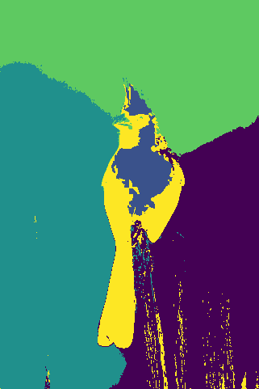 
  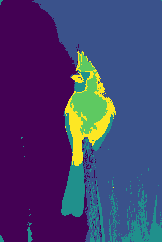 

## Introduction

The motivation behind our project is to compare how different methods and feature spaces affect segmentation, testing what we have learned in class. The final objective is to see how methods learned in class compare against state-of-the-art methods for segmentation.

The application of this project is to allow for exploration of how different methods fare while using different feature spaces for segmentation of images.

The domain for our project consists of regular RGB images, taken from the BSDS500 dataset. These are images that have been picked for segmentation and have ground truth human annotations available, but we are using the raw images to see how our methods compare.

## Approach

The techniques we will be comparing include:

1. Clustering-based approaches:

   - K-means clustering
   - Mean shift clustering

2. Graph-based approaches:

   - Min-cut
   - Normalized cut

3. State-of-the-art, Mask R-CNN

We will use the following feature spaces:

1. RGB color
2. RGB color + Position
3. HSV color
4. HSV color + Position
5. Texture using the Gabor filter bank

We are using the k-means and mean-shift methods from the ‘scikit-learn’ library.

For each feature space, k-means is run for each test image, with the number of clusters being determined by mean-shift, when run for the same image.

The bandwidth parameter for mean shift clustering will be estimated by the library code, and the number of modes found by mean shift will be used as the value of k in k-means.

Graph-based approaches will also be run for each feature space. Affinity weight for edges between pairs of pixels will be given by an exponential similarity function of Euclidean distance in that feature space. The min-cut approach will employ Edmonds-Karp or any other standard max-flow algorithm. For normalized cut, an approximate solution will be computed by solving the generalized eigenvalue problem on the affinity matrix.

We will treat the Mask R-CNN architecture and algorithm as a black box and make only minor modifications to suit our dataset’s needs.

For each of these algorithms, we use the benchmarking code provided by BSDS-500 to get consistent metrics that we can use to compare them. One of the obstacles we faced was figuring out how to convert our segmented images into a format that can be input into the benchmarking code, especially since our code is in python and the benchmark code is in Matlab.

## Experiments and Results

We used the Berkeley Segmentation Data Set and Benchmarks 500 as our dataset, and we ran our algorithms on the test dataset that they provided. This test set contains 200 images in total.

For this milestone, we have implemented the clustering algorithms (k-means and mean-shift) on the following four feature spaces: RGB, RGB + position, HSV, HSV + position.

  
  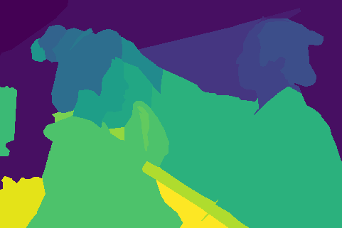 
  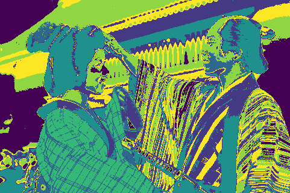 
  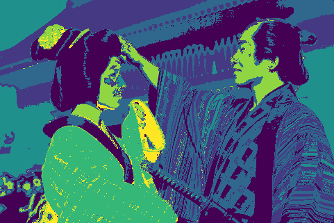
  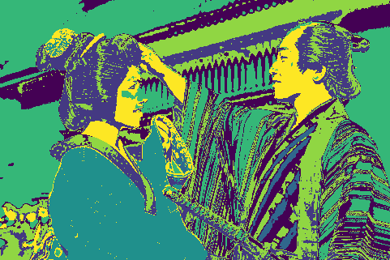 
  
   
  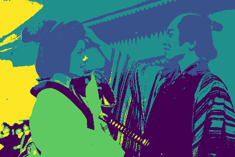 
  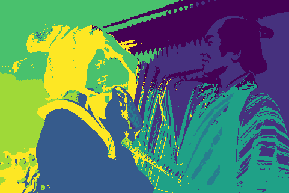 
   

We will use the following existing code:

- Texture: Garbor kernel implementation in the skimage library.
- K-means clustering: Scikit-learn’s implementation of the k-means algorithm.
- Mean shift clustering: Scikit-learn’s implementation of the mean shift algorithm. Scikit-learn also provides a utility to estimate the bandwidth parameter of the RBF kernel used.
- Min-cut: Standard Python implementation of Edmonds-Karp algorithm readily available online.
- Normalized cut: Skimage’s implementation which recursively performs a 2-way normalized cut on a passed in Region Adjacency Graph.
- Mask R-CNN: A convenient implementation of Mask R-CNN, with trained weights on the COCO dataset provided [here.](https://github.com/matterport/Mask_RCNN)

We will write our own code for the following:

- Mapping pixels to feature spaces. Utility functions to convert between color spaces will help but we will have to write most of the code ourselves.
- Finding the textons, the texton histograms and then clustering the histograms.
- Our own configuration and dataset parsing scripts to run the Mask R-CNN code on the BSDS500 dataset. Since this dataset doesn’t have enough examples to train a deep learning model from scratch, we will have to take a transfer learning approach and use weights trained from the COCO dataset.
- Code to compute metrics and quantitatively evaluate the quality of our segmentation. We will also aim to show interesting visualizations comparing the results from different methods.

We will evaluate the segmentation algorithms in two ways:

1. Find the segment boundaries and evaluate boundary benchmarks using the F-measure metric [2].
2. Evaluate the quality of segment regions using clustering metrics such as Rand Index, Variation of Information and Segmentation Covering [2].

We expect the experiment results to favor the Mask R-CNN approach, but we are curious to see how well classical CV techniques perform in comparison. It is expected that normalized-cut will perform better than min-cut since min-cut tends to pull out small isolated components. Amongst the clustering-based approaches, mean-shift should edge out k-means since k-means is biased towards finding circular data distributions. It will be interesting to see how different feature spaces impact each of the algorithms.

## Qualitative Results

## Conclusion and Futurework

## References

[1] D. Martin, C. Fowlkes, D. Tal, and J. Malik. A database of human segmented natural
images and its application to evaluating segmentation algorithms and measuring eco-
logical statistics. In Proc. 8th Int’l Conf. Computer Vision, volume 2, pages 416–423,
July 2001.

[2] Arbelaez, Pablo & Maire, Michael & Fowlkes, Charless & Malik, Jitendra. (2011). Contour Detection and Hierarchical Image Segmentation. IEEE transactions on pattern analysis and machine intelligence. 33. 898-916. 10.1109/TPAMI.2010.161.

# Team Members

- Anand Chaturvedi, achaturvedi32
- Prabhav Chawla, pchawla8
- Pranshav Thakkar, pthakkar7
- Sanskriti Rathi, srathi7

### [Link to project proposal](./proposal.md)
