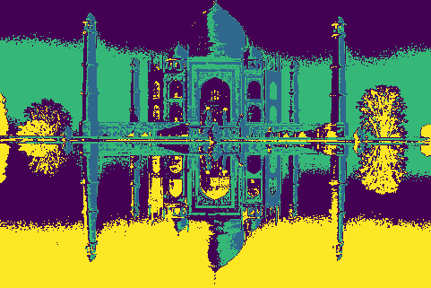
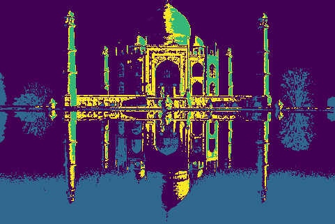
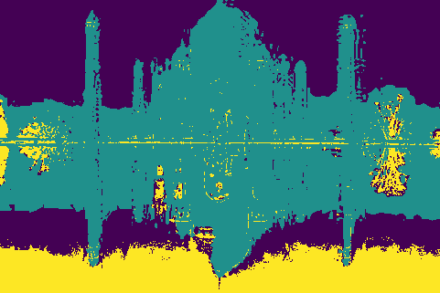
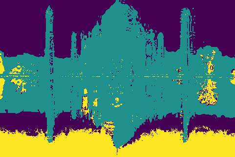
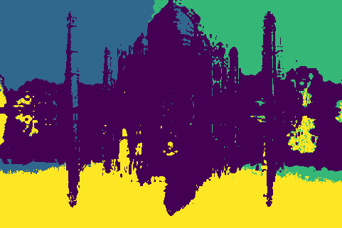

---
# Feel free to add content and custom Front Matter to this file.
# To modify the layout, see https://jekyllrb.com/docs/themes/#overriding-theme-defaults

layout: default
title: Team SegFault
---

<link rel="stylesheet" href="assets/css/custom.css">

# Final Project Update

## Abstract

The goal of our project is to compare different segmentation methods that we have learned about in class with current state-of-the-art techniques. We will also explore how different feature spaces affect clustering and graph-based approaches to segmentation.

**TODO** @Anand _Edit:_

~~For this milestone, we have written code to parse the Berkeley Segmentation image dataset (BSDS500) to extract various feature spaces from images, to run the K-Means and Mean Shift algorithms and to evaluate our segments using standard clustering metrics. According to our preliminary results, Mean Shift outperforms K-Means, and the HSV + Position feature space shows the most promising results.~~

## Teaser Figure

  
   
   
   
   
   

**TODO** @Prabhav _Add another row of pictures?_

## Introduction

The motivation behind our project is to compare different segmentation techniques and evaluate how they are affected by different feature spaces. The final objective is to see how methods learned in class compare against state-of-the-art methods for segmentation.

The domain for our project consists of regular RGB images, taken from the BSDS500 dataset. The dataset contains 200 training, 100 validation, and 200 test images and human annotations for all these images, which serve as the ground truth segmentations. The BSDS500 is an industry-standard for evaluating segmentation and contour detection algorithms. [1]

**TODO** @Anand _Edit or Delete:_

~~So far, we have been able to assess K-Means and Mean Shift’s performance on the test images. Using the ground truth, we have calculated region and boundary benchmarks, which are discussed in the Results section.~~

## Approach

**TODO** @Anand _Add/Edit content related to final update_

We ran K-Means and Mean Shift algorithms on the following four feature spaces:

1. RGB color
2. RGB color + Position (x, y pixel coordinates)
3. HSV color
4. HSV color + Position (x, y pixel coordinates)

We used Scikit-learn’s implementation of K-Means and Mean Shift. The bandwidth parameter for Mean Shift clustering was estimated using utility functions provided by Scikit-learn.

One drawback of using K-Means is that one has to specify the number of clusters. To avoid blindly trying different ‘k’ values for each image and each feature space, we used the number of modes picked up by Mean Shift as the value of ‘k’ for that particular image and that feature space. Instead of manually looking at each image, and guessing the number of clusters for each feature space of that image, we were able to automate the process and save a great deal of time and computer resources. We believe this choice is justified since it represents domain knowledge injection into our problem.

We used the benchmarking code provided by the BSDS500 dataset maintainers to obtain our metrics. This ensured that our metrics were reliably computed and were in a format that is easy to compare with existing benchmarks. The following metrics were computed for each algorithm and feature space:

1. F-measure; used to evaluate segment boundaries. [2]
2. Probabilistic Rand Index (PRI), Variation of Information (VOI) and Segmentation Covering; region-based metrics used to evaluate the quality of segments. [2]

An obstacle we faced was figuring out how to convert our segmented images into a format that can be interpreted by the benchmarking code. This was especially challenging since we wrote our code in Python, but the benchmarking code has been written in MATLAB.

**TODO** @Prabhav _Mention that setting up environment for Deep Learning approach was a challenge?_

## Experiments and Results

**TODO** @?? _Split the following appropriately between the Mean Shift and K-Means sub-sections. Also complete the two sub-sections by adding any missing content._

First, we focused on running the Mean Shift algorithm since the results would be used to determine 'k' values for K-Means.

We followed the following experimental set-up:

1. For each test image, compute a representation in all of the four feature spaces. Obtain an array of data for each one of those feature spaces.
2. Normalize the arrays - each feature vector has a mean of 0 and a standard deviation of 1 after the normalization. Clustering-based approaches generally benefit from data normalization.
3. For each array, estimate the bandwidth and run Mean Shift. Collect the clustering labels and the total number of clusters generated.
4. Save the number of clusters, for each image and feature space, in a dictionary for later use by K-Means.
5. Assign clustering labels to image pixels (basically, perform a mapping from feature space to image space). Save segmented images to disk in a format expected by the benchmarking code.

The above process was repeated for K-Means (leaving out certain Mean Shift specific steps).

### Mean Shift

**TODO** @?? _See TODO above_

### K-Means

**TODO** @?? _See TODO above_

### Min-Cut

**TODO** @Pranshav

### Normalized Cut

**TODO** @Sanskriti

### Context Encoding Network (EncNet)

**TODO** @Prabhav

 
**TODO** @Prabhav _Update the following with the latest figures:_

~~In total, we had 1600 segmented images (200 images × 4 feature spaces/image × 2 clustering algorithms) and 200 ground truth segments to run our benchmarking code.~~

### Quantitative Results

**TODO** @Prabhav _Add/Edit content related to final update. Don't forget the graph!_

The following table summarizes the F-measure metric:

| Segmentation Approach            | F-measure |
| -------------------------------- | :-------: |
| K-Means, RGB space               |   0.38    |
| Mean Shift, RGB space            |   0.45    |
| K-Means, HSV space               |   0.41    |
| Mean Shift, HSV space            |   0.49    |
| K-Means, RGB + Position space    |   0.44    |
| Mean Shift, RGB + Position space |   0.48    |
| K-Means, HSV + Position space    |   0.46    |
| Mean Shift, HSV + Position space |   0.50    |

The following table summarizes our region-based metrics:

| Segmentation Approach            | PRI  | VOI  | Covering |
| -------------------------------- | :--: | ---- | -------- |
| K-Means, RGB space               | 0.69 | 3.32 | 0.32     |
| Mean Shift, RGB space            | 0.67 | 2.88 | 0.39     |
| K-Means, HSV space               | 0.69 | 3.00 | 0.36     |
| Mean Shift, HSV space            | 0.61 | 2.47 | 0.41     |
| K-Means, RGB + Position space    | 0.71 | 2.63 | 0.36     |
| Mean Shift, RGB + Position space | 0.70 | 2.60 | 0.40     |
| K-Means, HSV + Position space    | 0.73 | 2.79 | 0.37     |
| Mean Shift, HSV + Position space | 0.70 | 2.41 | 0.44     |

Given that a human performs with F = 0.79, our vanilla implementations of simple clustering algorithms don’t perform too bad (Mean Shift obtains F = 0.50).

Mean Shift, across feature spaces, has (marginally) better F-measure values than K-Means. We also see higher Probabilistic Rand Index and lower Variation of Information with Mean Shift.

As far as feature spaces are concerned, HSV + Position achieves the best metrics, and RGB + Position. This makes sense as we can take into account more information with these feature spaces.

## Qualitative Results

**TODO** @Prabhav _Add/Edit content related to final update. Don't forget the web-app link!_

We illustrate our results for a couple of images:

  

    
Original Image

    
Ground truth segmentation
 
    
K-Means, RGB space segmentation

    
Mean Shift, RGB space segmentation

    
K-Means, HSV space segmentation

    
Mean Shift, HSV space segmentation

    
K-Means, RGB + Position space segmentation

    
Mean Shift, RGB + Position space segmentation

    
K-Means, HSV + Position space segmentation

    
Mean Shift, HSV + Position space segmentation

  

  

    
Original Image

    
Ground truth segmentation

    
K-Means, RGB space segmentation

    
Mean Shift, RGB space segmentation

    
K-Means, HSV space segmentation

    
Mean Shift, HSV space segmentation

    
K-Means, RGB + Position space segmentation
 
    
Mean Shift, RGB + Position space segmentation
 
    
K-Means, HSV + Position space segmentation
 
    
Mean Shift, HSV + Position space segmentation

  

## Conclusion and Futurework

**TODO** @?? _Add/Edit content related to final update_

~~In the coming weeks, we would like to repeat the same process for two graph-based and a deep-learning, state-of-the-art approaches. We will also aim to incorporate texture as a feature space in computing our results.~~

## References

[1] D. Martin, C. Fowlkes, D. Tal, and J. Malik. A database of human segmented natural
images and its application to evaluating segmentation algorithms and measuring eco-
logical statistics. In Proc. 8th Int’l Conf. Computer Vision, volume 2, pages 416–423,
July 2001.

[2] Arbelaez, Pablo & Maire, Michael & Fowlkes, Charless & Malik, Jitendra. (2011). Contour Detection and Hierarchical Image Segmentation. IEEE transactions on pattern analysis and machine intelligence. 33. 898-916. 10.1109/TPAMI.2010.161.

# Team Members

- Anand Chaturvedi, achaturvedi32
- Prabhav Chawla, pchawla8
- Pranshav Thakkar, pthakkar7
- Sanskriti Rathi, srathi7

### [Link to project proposal](./proposal.md)

### [Link to midterm update](./midterm.md)
