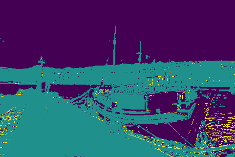

---
# Feel free to add content and custom Front Matter to this file.
# To modify the layout, see https://jekyllrb.com/docs/themes/#overriding-theme-defaults

layout: default
title: Team SegFault
---

<link rel="stylesheet" href="assets/css/custom.css">

# Final Project Update

## Abstract

The goal of our project is to compare different segmentation methods that we have learned about in class with current state-of-the-art techniques. We will also explore how different feature spaces affect clustering and graph-based approaches to segmentation.

We have written code to parse the Berkeley Segmentation image dataset (BSDS500) to extract various feature spaces from images and to run the K-Means, Mean Shift, and Normalized Cut algorithms. We also ran a deep learning model, EncNet, and evaluated our segments for all these methods using standard metrics. According to our results, Normalized Cut and EncNet outperform others. The HSV + Position feature space shows the most promising results across algorithms.

## Teaser Figure

  
   
   
   
   
   

## Introduction

The motivation behind our project is to compare different segmentation techniques and evaluate how they are affected by different feature spaces. The final objective is to see how methods learned in class compare against state-of-the-art methods for segmentation.

The domain for our project consists of regular RGB images, taken from the BSDS500 dataset. The dataset contains 200 training, 100 validation, and 200 test images and human annotations for all these images, which serve as the ground truth segmentations. The BSDS500 is an industry-standard for evaluating segmentation and contour detection algorithms. [1]

We assessed the performance of clustering, graph-based, and deep learning segmentation techniques on the test images. Using the ground truth, we have calculated region and boundary benchmarks, which are discussed in the Results section.

## Approach

We ran K-Means, Mean Shift and Normalized Cut algorithms on the following four feature spaces:

1. RGB color
2. RGB color + Position (x, y pixel coordinates)
3. HSV color
4. HSV color + Position (x, y pixel coordinates)

We used Scikit-learn’s implementation of these three algorithms. The bandwidth parameter for Mean Shift clustering was estimated using utility functions provided by Scikit-learn.

One drawback of using K-Means is that one has to specify the number of clusters. To avoid blindly trying different ‘k’ values for each image and each feature space, we used the number of modes picked up by Mean Shift as the value of ‘k’ for that particular image and that feature space. Instead of manually looking at each image, and guessing the number of clusters for each feature space of that image, we were able to automate the process and save a great deal of time and computer resources. We believe this choice is justified since it represents domain knowledge injection into our problem.

For Normalized Cut, we used scikit-learn's implementation for the method as well as for generating the Region Adjacency Graph (RAG). Here, instead of considering each pixel as a node (like would generally happen), we first used K-Means to segment every picture into regions. We then created the RAG using each of these regions as a node and applied Normalized Cut to the resulting graph. This is because having a graph with each pixel as a node would significantly increase run-time. We decided to use k=400 segments for the RGB and HSV feature spaces and k=1000 segments for the ones with position in the interest of time. The edge weights between regions were generated by averaging all the pixels in a region and then using an exponential similarity measure.
An obstacle we faced in this implementation was the incompatibility of scikit-learn's RAG generating code with our 5-dimensional feature spaces with position. For this, we had to change their implementation just a little bit, so it would accept matrices the way we were generating them.

For the state-of-the-art deep learning approach, we chose the Context Encoding Network (EncNet) implementation by H. Zhang et al. (2018) [3]. The training code and pre-trained models are readily available on [GitHub](https://github.com/zhanghang1989/PyTorch-Encoding). We decided against taking a transfer learning approach since the BSDS500 dataset lacks class labels, so tuning a larger, pre-trained EncNet on BSDS500 was not possible without a lot of manual annotation work. In some sense, this is a good test of EncNet's ability to generalize to a novel dataset that it has not seen before.

We used the benchmarking code provided by the BSDS500 dataset maintainers to compute the following metrics reliably:

1. F-measure; used to evaluate contour lines obtained from segmented regions. [2]
2. Probabilistic Rand Index (PRI), Variation of Information (VOI), and Segmentation Covering; region-based metrics used to evaluate the quality of segments. [2]

An obstacle we faced was figuring out how to convert our segmented images into a format that could be interpreted by the benchmarking code. It was especially challenging since we wrote our code in Python, but the benchmarking code has been written in MATLAB.

## Experiments and Results

The chosen segmentation methods all have unique properties, and thus required different experimental set-ups. We have categorized our experiment by the algorithms below.

### Mean Shift

We ran the Mean Shift algorithm first since the results would be used to determine 'k' values for K-Means. We followed the following experimental set-up to perform Mean Shift:

1. For each test image, compute a representation in all of the four feature spaces. Obtain an array of data for each one of those feature spaces.
2. Normalize the arrays - each feature vector has a mean of 0 and a standard deviation of 1 after the normalization. Clustering-based approaches generally benefit from data normalization.
3. For each array, estimate the bandwidth and run Mean Shift. Collect the clustering labels and the total number of clusters generated.
4. Save the number of clusters, for each image and feature space, in a dictionary for later use by K-Means.
5. Assign clustering labels to image pixels (basically, perform a mapping from feature space to image space). Save segmented images to disk in a format expected by the benchmarking code.

Below is an [illustration](https://cs-6476-project.herokuapp.com/?q=118015) of outputs for the Mean Shift algorithm:

  

    
    Original image
  

  

    
    Ground truth, segs=21
  

  

    
    RGB space, segs=7
  

    

    
    HSV space, segs=7
  

    

    
    RGB + Pos space, segs=9
  

    

    
    HSV + Pos space, segs=9
  

In this example, Mean Shift is able to segment the sky from the rest of the image but has some trouble picking up on the boat in the foreground. The feature spaces with position seem to be better at distinguishing continuous elements such as the walkway. This creates nuanced segments that weren't included in the hand-labeled ground truth image.

### K-Means

For K-Means, we repeated the process described above but left out certain Mean Shift specific steps. Sample [output](https://cs-6476-project.herokuapp.com/?q=235098) for all feature spaces is shown below:

  

    
    Original image
  

  

    
    Ground truth, segs=21
  

  

    
    RGB space, segs=7
  

    

    
    HSV space, segs=7
  

    

    
    RGB + Pos space, segs=9
  

    

    
    HSV + Pos space, segs=9
  

For this particular image, all feature spaces do a reasonably good job. The impact of adding position is very apparent based on the output above - the sky is segmented into more parts when the pixel position is taken into account.

### Normalized Cut

For the Normalized Cut implementation, on each picture, we first ran K-Means with a large number of segments and then used the resulting regions to make the Region Adjacency Graph required for a graph-based method like Normalized Cut. Here is the [output](https://cs-6476-project.herokuapp.com/?q=140006) for a sample image:

  

    
    Original image
  

  

    
    Ground truth, segs=10
  

  

    
    RGB space, segs=28
  

    

    
    HSV space, segs=22
  

    

    
    RGB + Pos space, segs=42
  

    

    
    HSV + Pos space, segs=34
  

For this image, Normalized Cut does a good job of segmenting each of the houses and the humans separately. While the RGB space segmentation is fairly close to the ground truth segmentation with each house being divided into one or two segments, the other three feature spaces over-segment. It is also apparent that using K-Means segments instead of pixels as nodes in our graph has taken away most of the boundaries, and as a result, we don't get sharp segments at all.

### EncNet_ResNet101_PContext

We treated the EncNet implementation as a black box and did not make any modifications to the existing codebase. The pre-trained model uses the ResNet-101 convolutional neural network as a basic feature extractor and the PASCAL-Context dataset for training, which is a standard semantic segmentation dataset consisting of about 30k images and 400+ labels. Unlike our other approaches, the model made predictions on raw, test image data instead of hand-crafted, feature-space specific features. Here is an [illustration](https://cs-6476-project.herokuapp.com/?q=80085) of the output we obtain:

  

    
    Original image
  

  

    
    Ground truth, segs=28
  

  

    
    EncNet, segs=12
  

The EncNet approach is very good at segmenting individual entities from the background scene; however, it scarcely divides up the different parts of an entity. In the ground truth image above, the lady in the foreground is divided into at least four different segments, but EncNet uses just one segment. This is not necessarily a bad thing; whether or not more than one segment should be used per entity depends on a case-by-case basis.

### Quantitative Results

We ran our benchmarking code on a total of 2600 segmented images (200 test images × 4 feature spaces/image × 3 approaches with feature spaces + 200 test images × 1 approach without feature spaces) and 200 ground truth segments.

 

The following graph summarizes the F-measure metric:

  

<!--
| Segmentation Approach           | F-measure |
| ------------------------------- | :-------: |
| K-Means, RGB space              |   0.38    |
| Mean Shift, RGB space           |   0.45    |
| Normalized Cut, RGB space       |   0.58    |
| K-Means, HSV space              |   0.41    |
| Mean Shift, HSV space           |   0.49    |
| Normalized Cut, HSV space       |   0.56    |
| K-Means, RGB + Pos space        |   0.44    |
| Mean Shift, RGB + Pos space     |   0.48    |
| Normalized Cut, RGB + Pos space |   0.49    |
| K-Means, HSV + Pos space        |   0.46    |
| Mean Shift, HSV + Pos space     |   0.50    |
| Normalized Cut, HSV + Pos space |   0.51    |
| EncNet                          |   0.44    |
-->

We observe that Normalized Cut achieves the highest F-measure scores across all feature spaces. In general, Normalized Cut divided images into a greater number of segments, so it was able to predict boundaries better than other algorithms. Mean Shift with HSV + Position feature space (F = 0.50) trails close behind. While none of the approaches came close to beating human-level performance (F = 0.79), a few achieved higher Recall than human performance. Notably, K-Means with RGB Space achieves a Recall close to 1, but that comes at the cost of low Precision. It seems this simple approach picked up the actual boundaries, but also quite a few false positives. EncNet performs modestly - pre-trained models usually need to be fine-tuned to specific datasets to achieve optimal performance; however, as discussed earlier, the BSDS500 dataset is not suitable for this purpose. Additionally, deep learning segmentation models are typically evaluated using a different set of metrics such as mean Intersection over Union and pixel Accuracy. [3]

 

The following table summarizes the region-based metrics (in descending order of overall performance):

| Segmentation Approach           | PRI  | VOI  | Covering |
| ------------------------------- | :--: | ---- | -------- |
| EncNet                          | 0.74 | 2.06 | 0.52     |
| Normalized Cut, HSV space       | 0.75 | 2.16 | 0.51     |
| Normalized Cut, RGB space       | 0.75 | 2.19 | 0.50     |
| Mean Shift, HSV + Pos space     | 0.70 | 2.41 | 0.44     |
| Normalized Cut, HSV + Pos space | 0.76 | 2.65 | 0.45     |
| Normalized Cut, RGB + Pos space | 0.75 | 2.68 | 0.44     |
| Mean Shift, RGB + Pos space     | 0.70 | 2.60 | 0.40     |
| Mean Shift, HSV space           | 0.61 | 2.47 | 0.41     |
| K-Means, RGB + Pos space        | 0.71 | 2.63 | 0.36     |
| K-Means, HSV + Pos space        | 0.73 | 2.79 | 0.37     |
| Mean Shift, RGB space           | 0.67 | 2.88 | 0.39     |
| K-Means, HSV space              | 0.69 | 3.00 | 0.36     |
| K-Means, RGB space              | 0.69 | 3.32 | 0.32     |

EncNet and Normalized Cut with HSV space perform the best here. Their Probabilistic Rand Index and Covering scores are amongst the highest, and their Variation of Information scores are the lowest. As far as feature spaces are concerned, HSV + Position generally produces a higher quality of segmented regions.

## Qualitative Results

We illustrate our results for a sample image:

  

    
    Original image
  

  

    
    Ground truth, segs=26
  

  

    
    EncNet, segs=3
  
 
  

    
    K-Means, RGB space, segs=7
  

  

    
    Mean Shift, RGB space, segs=7
  

  

    
    Normalized Cut, RGB space, segs=71
  

  

    
    K-Means, HSV space, segs=7
  

  

    
    Mean Shift, HSV space, segs=7
  

  

    
    Normalized Cut, HSV space, segs=51
  

  

    
    K-Means, RGB + Pos space, segs=5
  

  

    
    Mean Shift, RGB + Pos space, segs=5
  

  

    
    Normalized Cut, RGB + Pos space, segs=67
  

  

    
    K-Means, HSV + Pos space, segs=8
  

  

    
    Mean Shift, HSV + Pos space, segs=8
  

  

    
    Normalized Cut, HSV + Pos space, segs=72
  

To view more results, please visit the website: <https://cs-6476-project.herokuapp.com>. On every page load, the site randomly picks an image from the test set and displays the corresponding segmented images.

## Conclusion and Futurework

**TODO** @Sanskriti _Add/Edit content related to final update. "In the Conclusions section, you should re-iterate the goals that you had laid out in your mid-term update and clearly mention whether you were able to accomplish those goals. If not, then what were the reasons. Also, in the Future Work section, you should mention any interesting extensions of your project that you can think of."_

~~In the coming weeks, we would like to repeat the same process for two graph-based and a deep-learning, state-of-the-art approaches. We will also aim to incorporate texture as a feature space in computing our results.~~

## References

[1] D. Martin, C. Fowlkes, D. Tal, and J. Malik. A database of human segmented natural
images and its application to evaluating segmentation algorithms and measuring eco-
logical statistics. In Proc. 8th Int’l Conf. Computer Vision, volume 2, pages 416–423,
July 2001.

[2] Arbelaez, Pablo & Maire, Michael & Fowlkes, Charless & Malik, Jitendra. (2011). Contour Detection and Hierarchical Image Segmentation. IEEE transactions on pattern analysis and machine intelligence. 33. 898-916. doi: 10.1109/TPAMI.2010.161.

[3] Zhang, H., Dana, K., Shi, J., Zhang, Z., Wang, X., Tyagi, A., & Agrawal, A. (2018). Context Encoding for Semantic Segmentation. 2018 IEEE/CVF Conference on Computer Vision and Pattern Recognition. doi: 10.1109/cvpr.2018.00747

# Team Members

- Anand Chaturvedi, achaturvedi32
- Prabhav Chawla, pchawla8
- Pranshav Thakkar, pthakkar7
- Sanskriti Rathi, srathi7

### [Link to project proposal](./proposal.md)

### [Link to midterm update](./midterm.md) (_UI is broken, please refer for content only_)
